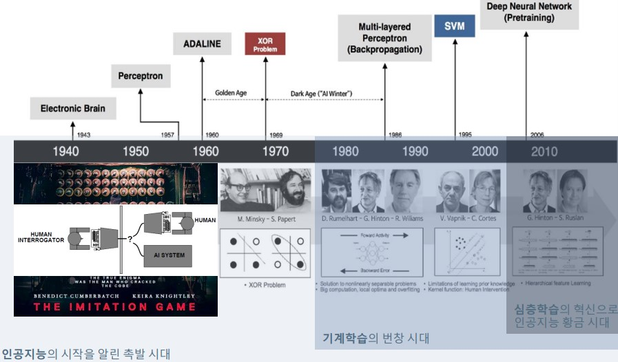
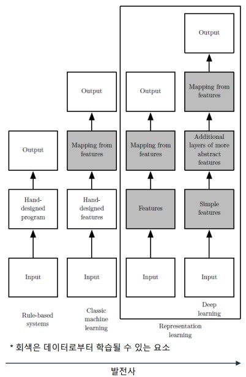

# 인공지능
    인간의 지능적 능력을 인공적으로 구현하려는 컴퓨터과학의 분야
* 여러 인공지능의 요소 중 학습에 집중
## 인공지능의 역사
</img>

* Percaptron(뉴런1개)-> Multi-Layered Percaptron-> Deep Neural Network
## 인공지능 발전사
</img>
* `Rule Based System`-> `Classic Machine Learning` (사람의 정보를 이용해서 특징들을 mapping함)-> `Representation Learning` (사람이 개입하지 않음) 중 하나인 `Deep Learning` (신경망을 사용함=> 규칙을 계층적으로 발견함)

# 기계학습
* `Mitchell` : 어떤 컴퓨터 프로그램이 `T라는 작업`을 수행하고 이 프로그램의 `성능을 P`라는 척도로 평가할 때 `경험 E`를 통해서 성능이 개선된다면 해당 프로그램은 `학습`을 한다고 한다. 
* `(E*T=P)` 관찰한 데이터를 기반으로 숨겨진 규칙을 스스로 알아냄
## 기계학습의 유형
* 교사학습
    * `데이터x` 와 이에 따른 `label값 y`를 알려줌. (입력값과 정답을 알려줌)
        * ex> 회귀와 분류 예측에 쓰임 (쉬운 문제)
* 비교사학습
    * `데이터x` 만 주어지고 `label값 y`를 알려주지 않음(데이터의 특징을 알아냄)
        * ex> 군집화
* 강화학습
    * 입력과 결과값을 알려주지만 어떤 목표치를 최대화하기 위한 학습
    * 상호관계를 통한 학습
        * ex> 바둑
* 준교사학습
    * `데이터x`의 수집은 쉽지만 `label값 y`를 얻는 것은 어렵다.
    `(ex>의료쪽)`
    => `준교사학습` : 일부는 x와 y를 모두 가지지만, 나머지는 x만 가진 상황

## 기계학습 모델의 유형
* 온라인 모델과 오프라인 모델
    * `온라인`: 실시간 데이터를 점진적으로 학습
    * `오프라인`: 데이터 집합을 모아서 학습하는 일반적인 모델
* 결정론적 모델과 확률론적 모델
    * `결정론적 모델`: 데이터 집합을 가지고 학습하면 매번 동일한 결과를 만드는 모델
    * `확률론적 모델`: 학습 과정에서 확률적 분포요소를 추가하여 동일한 데이터 집합이라도 수행할 때마다 다른 결과를 만들 수 있는 모델
* 분별 모델과 생성모델
    * `분별 모델`: 데이터와 정답간의 관계가 목적인 모델
    * `생성 모델`: 데이터 생성이 목적인 모델
### 학습과업

* `분류`: 출력값이 비연속적(ex>사진구별)
* `회귀`: 출력값이 연속적(ex>주식)
* `밀도추정`: (ex>분포측정, 확률)

## 기계학습의 필요조건
    Data, Pattern, Non Closed-Form Solution(수학적으로 설명되지 않는 규칙성을 모델이 근사화 시키는 과정임)

## 데이터와 특징공간
현실에서는 `데이터 생성과정P(X)`를 모르는 상황에서 관찰된 데이터만으로 규칙을 근사 추정해야함
->`P(X) (고양이가 생성되는 과정)`,` P(y|X) (ex>고양이사진을 보고 고양이임을 알아내는 과정)` 를 모르는 상황에서 `Training exmaples(x1,y1),(x2,y2)..`를 통해서 `P(X)`, `P(y|X)`를 유추함
* 데이터 수집-> 모델정립(가설)-> 예측-> 데이터 수집...

    즉 데이터에 따라 성능이 결정됨 즉 데이터의 양과 질이 중요하다.