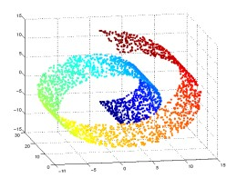
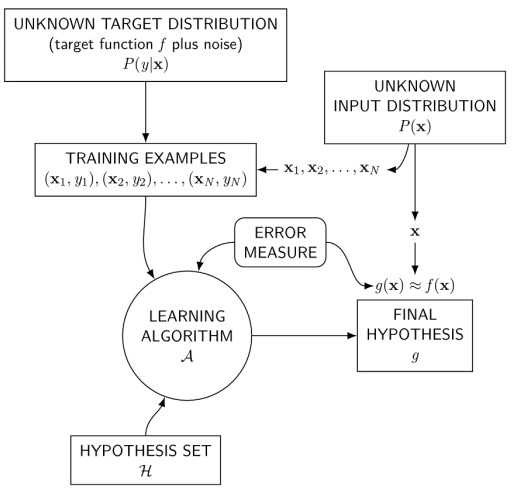

# 데이터와 특징 공간

기계학습은 문제을 해결할 수 있는 데이터에 숨은 규칙을 찾아가는 행위   
하지만 데이터 생성과정 p(x)을 알 수 없고 이 때문에 기계학습이 어려워진다   
즉 관찰된 데이터만으로 규칙을 근사 추정해야 한다   
즉 주어진 문제에 적합한 다양성을 보장할 수 있는 `충분한 양의 데이터`를 수집하면 성능 향상을 기대할 수 있다   

데이터 수집-> 모델정립(가설)-> 예측-> 데이터 수집...

## 컴퓨터가 사진을 이해하는 방식

1. 사진을 `벡터화`(공간)한다.
    * 모든 관찰 데이터는 정량적으로 표현할 수 있으며 특징공간 상에 존재할 수 있다
2. 벡터화된 n차원 데이터에서 `거리`와 `내적`을 통해 유사도를 검사할 수 있다   
    * 벡터는 크기(`거리`)와 방향(`내적`)으로 이루어져 있기 때문이다 (비슷하다는 척도= 거리or내적)
3. 혹은 선형변환 벡터에서부터 공간의 변환
    * (ex 3차원 벡터를 2차원에 투영 => 시각화 가능)

### 차원의 저주

    차원이 커질수록 동일한 개수의 데이터의 밀도는 희박해진다.
    차원이 증가할수록 필요한 데이터의 개수가 기하급수적으로 증가한다.

하지만 희소한 데이터의 양이더라도 성능을 예상할 수 있다(ex> MNIST)
그 이유에는 `희소 특성 가정`, `매끄러움 가정`, `매니폴드 가정`이 있다.
* 희소 특성 가정 : 실제 고차원 공간에서 실제 데이터가 발생하는 영역은 매우 희소한 공간이다
* 매끄러움 가정 : 희소한 공간안에서도 유사한 데이터는 유사한 규칙에 의해 발생된다
* 매니폴드 가정 : 고차원의 데이터는 관련된 낮은 차원의 공간의 조합으로 구성된다
### 매니폴드 가정

* 고차원의 데이터의 밀도는 낮지만, 이들의 집합을 포함하는 저차원의 매니폴드가 있다   
</img>   
위 사진은 스위스롤이라 부른다   
스위스롤 색상을 유사한 정도라 할 시   
이 상태은 거리랑 유사도는 크게 연관이 없지만 `스위스롤을 풀어버리면` 거리와 연관이 생겨진다
즉 풀어진 스위스롤의 공간을 찾을 수 있다면 의미나 규칙을 추출하기 쉬워진다.

### 데이터의 양/질과 기계학습 성능
* 데이터 양
    * 데이터의 개수에 따라 모델을 선택해야하며 데이터가 늘어날수록 모델의 성능은 늘어난다
* 데이터 질
    * 기계학습 편향성이 생기지 않도록 한다

# 기게학습
## 기계학습 개요
</img>    

여러 가설(`HYPOTHESIS SET`) 중 한가지를 선택한 후` LEARNING ALGORITHM` 과 `ERROR MEASURE`(판단지표가 된다) 을 통해 가설을 입중해본다. 이를 통해 입증된 가설이 `FINAL HYPOTHESIS`이다.

    에러가 낮아지도록 조정하는 과정=> Learning algorithm

### 데이터의 구분
* `훈련데이터집합` -> 연습문제
* `검증데이터집합` -> 모의고사
    * 여러 모델(가설) 중 한가지를 선택하기 위한 데이터의 집합    
    (훈련데이터집합으로는 비슷한 성능을 보이기 때문이다)
* `시험데이터집합` -> 수능

### 목적함수

모델의 예측값과 목표값을 받고 그 사이의 차를 측정하여 반환하는 함수

목적함수 = 오차(에러) = 성능 = 비용함수 => ERROR MEASURE
* 정량적 성능 판단 지표-> 학습이 진행될수록 점차 개선되어야 함(점차 오차값이 줄어들어야함)

목적함수의 예시
    평균제곱오차 (오차의 차이의 제곱의 평균)

    적절한 목적함수를 설정하면 이 목적함수는 훈련과정에 사용된다.

### 기계학습의 개요

    기계학습을 통해 관찰된 데이터 집합의 규칙을 찾는다

* 가설: 눈대중으로 보면 데이터 집합이 직선을 이루므로 직선의 모델 선택
    * ex>  직선의 모델 수식: y = wx + b <= 2개의 학습 매개변수 w, b

* 훈련과정(러닝알고리즘): 기계학습은 가장 정확하게 예측할 수 있는 최적의 매개변수를 찾는 작업

* 추론과정(훈련과정을통해 얻어낸 w,b를 일반적인 상황에서 얼마나 정확한가 확인 => 수능)
    * => 일반화된 성능을 보장한다 볼 수 있다
        

