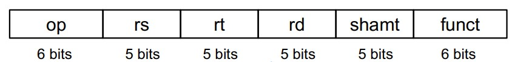
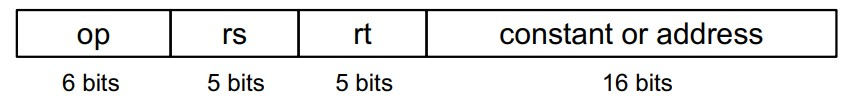

nor x, a, b
    a 와 b를 or한 것에 1의 보수 처리한 결과를 x에 저장한다
    not(A) = A nor A = A nor 0
sll x, a, i
    왼쪽으로 i bit shift 하는 것
    2**i를 곱하는 것과 같지만 연산속도는 더 빠르다
srl x, a, i
    오른쪽으로 i bit shift 하는 것
    2**i를 나누는 것과 같지만 연산속도는 더 빠르다
bit masking

MIPS instructions 는 32비트로 인코딩된다

MIPS R-format instructions

</img>   
        op,funct: 덧,뺄셈
        rs,rt,rd
            레지스터(5비트-> 레지스터가 32개이기 때문에)
            도착 레지스터의 위치가 앞에서 뒤로 변한 이유:
                하드웨어와 연계되며 효율적이기 위해
            shift 할 때는 rs를 0으로
    MIPS opcode map or MIPS Reference Data or Arithmetic and Logical Instructions
        이곳에서 op,funct 코드를 찾는다

    기계어=>어셈블리어
    16진수-> 2진수-> format에 맞게 분할-> 해석

MIPS I-format instructions   
</img>   
    op,rs,rt,constant or address
    or,and -> no sign
    add-> sign
addi,ori,andi=> I
add,sub,shift=> R

레지스터 한개당 32비트 저장될 수 있다.
    I를 쓸 때 constant or address에 있는16비트를 32비트로 늘려줘야 한다.
        logical를 쓸 때 (no sign) 
            ?=0으로 채운다. 9.15p 
        addi를 쓸 때 (sign)
            sign이 있으므로 이에 따라 ?=0 or 1(sign extension)로 채운다

sign extension?
부호확장
ex> 0000_0001 => 0000_0000 0000_0000 0000_0000 0000_0001
    1111_1111 => 1111_1111 1111_1111 1111_1111 1111_1111
제로확장도 있으며 no sign일 때 사용된다

