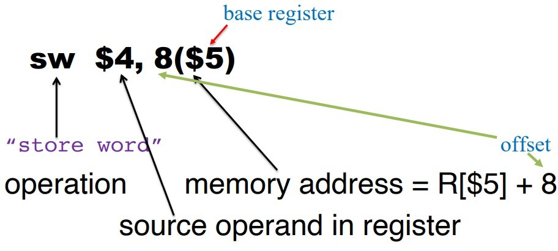

# I format
## addi ori 차이   
* sign zero의 차이
    * sign extension: 최상위 비트를 확장하는 비트에 넣는다
    * zero extention: 확장하는 비트에 0을 넣는다   

### SPIM 어셈블러의 두가지 원칙에 대해 보자면   
1. out-of-range 범위는 명령어 종류에 따라 결정된다.
    * 산술명령어(addi,addiu) : 값의 범위 => -32768~32767 (signed number)
    * 논리명령어(andi,ori) : 값의 범위 => 0~65535 (unsigned number)
2. 상수 operand 는 십진수인지 16진수인지에 따라 해석된다.
    * 십진수 : signed number
    * 16진수 : unsigned number

#### 이를 잘 알려주는 명령어를 예시로 보자면    

addi $t1, $0, 0x8000   
1. 우선 상수 operand가 16진수이므로 unsigned number가 된다 = 32768
2. 산술명령어 이므로 값의 범위가 -32768~32767 이다 = out-of-range error

ori $t1, $0, -32768   
1. 우선 상수 operand가 10진수이므로 signed number가 된다 = -32768
2. 논리명령어 이므로 값의 범위가 0~65535 이다 = out-of-range error

    에러가 안되기 위해서는 산술명령어를 쓸 때는 10진수를, 논리명령어를 쓸 때는 16진수를 쓰면 좋다

#### 다른 상황
예시부터 보자면   
```s
addi $10, $0, 0x8000
ori $10, $0, 0x8000
```
addi $10, $0, 0x8000 # 1000 0000 0000 0000   
out-of-range error가 발생하고
0x8000이 16진수로 쓰여있으므로 sign extension하지 않고   
ori $10, $0, 0x8000이 수행된다.


## lui rt, constant
* upper bit에 immediate값을 load 해주는 연산이다.
* 즉 상위 비트에 constant를 추가해준다
* ex> lui $s0, 0x007D = 0000 0000 0111 1101 0000 0000 0000 0000

### addi out-of-range error 일때
* lui와 ori를 통해 addi를 나타낸다.
* ex> addi $t1, $0, 0x7fffffff
    * lui $t1, 0x7fff   
    ori $t1, $t1, 0xffff

## 유사 명령어 (Pseudoinstruction)
* 기계어 명령어는 아닌데 assembly 명령어만 있는 명령어
* 프로그래머의 편의를 위해 존재

### li
* [li A B] = [A <- B]
* ex> li $10, 1

#### 1번 레지스터는 임시용으로 특별한 용도가 있다(사용하지 말자)
`(MIPS pipeline processor simulator 를 완성도있게 구현)`

# data segment 시작
# MIPS Data Transfer Operations

## store instruction : register -> memory
</img>   

* sw $4, 8($5)
    * 4번 레지스터에 있는 값을 R[$5]+8의 메모리부터 저장한다.
* 메모리 address를 레지스터와 엮어서 나타내는 이유
    * I format 형식이어서 최대 16비트 밖에 나타낼 수 없어서 최대 32비트인 레지스터의 도움을 받는다

## load instruction : memory -> register
* lw $4, 8($5)
    * 4번 레지스터에 R[$5]+8의 메모리부터 있는 값을 저장한다.

    메모리는 1바이트만 저장 가능하기 때문에 앞에 memory address는 저장 시작점으로 보면 좋다