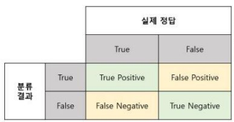

# 획득과 표현
* 컴퓨터가 이미지(3차원->2차원)를 이해하는 방식
* `샘플링` (2차원을 M*N으로 샘플링), `양자화` (명암 (or RGB) 을 L단계로 양자화)

# 영상좌표계 

    화소위치를 배열로 표현 ex> x(j,i)
    이후 x=> f(x) 컬러영상은 fr(x),fg(x),fb(x) 3채널로 구성
    => 여러 채널로 표현될 수 있다.

# 컴퓨터 비전의 2가지 접근
* `과학적 접근` : 사람의 시각에 맞먹는 인공 시각을 만든다.(뇌과학-> 지식표현, 학습, 추론, 창작 같은 인공지능 요구)
    * 어려운 이유 : `역문제`(3차원->2차원으로 가면서 정보손실), `불량문제`(ex>ill-posed ploblem; 정답이 없는 문제(저화질->고화질로 바꿀때)), `다양한 변형 발생`
* 공학적 접근: 한정된 범위에서 특정한 임무를 달성하는 인공 시각을 만든다. (ex> 정밀측정, 칩 검사)
    * 실용적인 성능 달성의 어려움: 역문제, 불량문제, 다양한 변형 발생
# 계층적 처리
* `전처리` : 주로 영상 처리(잡음, 노이즈 없애기)
* `특정 추출` : 에지, 선분, 영역, 텍스처, 지역 특징 등을 검출하고 특징 벡터 추출
* `해석` : 응용에 따라 다양한 형태
</img>

        과거에는 사람이 직접적으로 연구 (머신러닝), 최근에는 분류와 함께 자동적으로 처리 (딥러닝)
    
# 문제해결도구

    과거: 자료구조와 알고리즘
    현재: 수학 (선형대수..), 기계학습 이용

# 시스템 설계
* `순차 처리와 피드백` : 문제 이해-> 데이터베이스 수집-> 알고리즘 설계와 구현-> 성능 평가
* `문제이해` : 주어진 문제에 대한 직관적이고 철저한 이해 중요(문제 인식이 중요함) 즉 합리적 제약 조건 수립이 필요함
* `데이터베이스 수집` : 학습 집합(이걸로 학습)+ 테스트 집합(이걸로 테스트)
* '알고리즘 설계와 구현' : 새로운 알고리즘 개발 또는 기존 알고리즘 중에서 주어진 문제에 적합한 것 선택(데이터베이스를 이용하여 성능 실험을 해 봄)
    * `알고리즘 설계와 구현` : 머신러닝vs딥러닝
            Learning: P(performance),T(task),E(experience)를 기반으로 러닝을 결정함

# 성능평가
</img>

    분류결과와 실제정답을 비교

* `정확률` Precision 분류결과 T 중에서 실제정답 T 인 지표
</img>
* `재현율` Recall 실제정답 T 중에서 분류결과 T 인 지표
</img>
* `정확도` Accuracy 전체 분류결과 중에서 참인 지표
</img>
