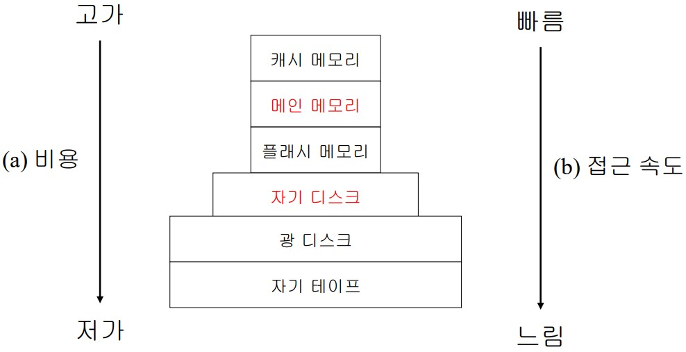
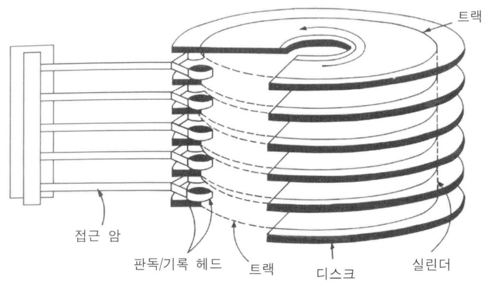
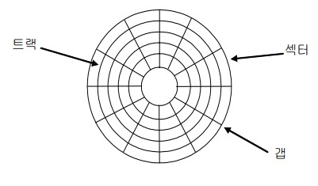

# 화일의 기본
## 화일 사용의 형식
* 일괄처리(batch) 형식

  마스터 화일이 효율적으로 접근하도록 트랙잭션(요청)을 구성함

* 대화(interactive)형식

    트랜잭션(요청)이 도착하는 대로 구성하고 처리함

## 화일 기본 연산
* 화일 단위 연산

    화일의 생성 (create)
    화일의 개방과 폐쇄 (open/close)
    화일의 삭제 (delete)

* 레코드 단위의 연산

    레코드 검색/판독 (retrieve/read)
    레코드 갱신 (update)
    삽입,삭제,수정 (insert,delete,modify)

# 화일 저장장치
## 저장 장치의 분류
* 1차 저장 장치
    * 소멸성:volatile
    * 메인 메모리,캐시메모리
* 2차 저장 장치
    * 비소멸성
    * 자기 디스크,광 디스크,자기 테이프

## 저장장치의 유형(사진)
</img>

## 디스크
</img>

    디스크 팩 (6개의 디스크가 있으면 기록은 총 10개까지 됨(제일 위 아래는 사용x))
    자화된 데이터를 읽을려면 헤드가 필요함
    헤드를 앞뒤로 옮기기 위해 접근 암에 모터 한개, 디스크팩를 돌리기 위한 모터까지 총 두개의 모터가 필요

## 데이터의 저장
* 블록 (기본 단위)
    * 디스크에서 데이터를 읽고 쓰는 "최소 단위"로 하나 이상의 섹터에 저장
 
### 디스크의 구성
</img>

    디스크가 도는데 같은 시간이 걸리므로 중심에서 멀리있으나 가까이 있으나 데이터가 동일하다 (각속도)    
    안쪽은 너무 조밀하게 써야되서 데이터가 중첩되므로 사용할 수 없다.

* 섹터
    * 피자조각
* 트랙
    * 동심원
* 갭
    * 섹터를 분리하는 선으로 데이터를 쓸 수 없는 공간

## 데이터 전송 연산 시간

    탐구시간+헤드활동시간+회전지연시간+전송시간
* 탐구 시간
    * 암이 실린더까지 이동하는 시간
* 헤드 활동 시간
    * 전기신호=0ms
* 회전 지연 시간
    * 헤드에 트랙이 오기까지 걸리는 시간
        * 평균 1회전시간의 반
* 전송시간
    * 전기신호=0ms

### 유동 헤드 디스크

    탐구 시간 (디스크에 주어짐) 
        5~6ms
    헤드 활동 시간
        0ms
    회전 지연 시간
        8.33ms, 4.16ms
            분당 회전수 RPM 3600,7200=>1회전시간의 반이기 때문에      
    전송시간
        0ms

### 고정 헤드 디스크

    각 트랙마다 하나의 헤드가 주어진다.
    => 탐구 시간=0ms 
    => 하드디스크의 읽는 속도가 빨라진다.

### 윈체스터 디스크
* 기록면 ,접근 장치, R/W 헤드가 함께 봉인
* 헤드가 디스크에 근접하기 때문에 기록밀도가 높다.
* 보편적인 하드디스크는 윈체스터 디스크

## HDD
* 데이터 전송 시간 관련
    * seek time
    * 분당 회전수(RPM) : rotation delay 계산에 사용한다.
* 저장 용량 관련
    * 디스크 드라이브의 원반 수
    * 기록 면당 트랙 수
    * 트랙당 섹터 수
    * 섹터의 크기
    