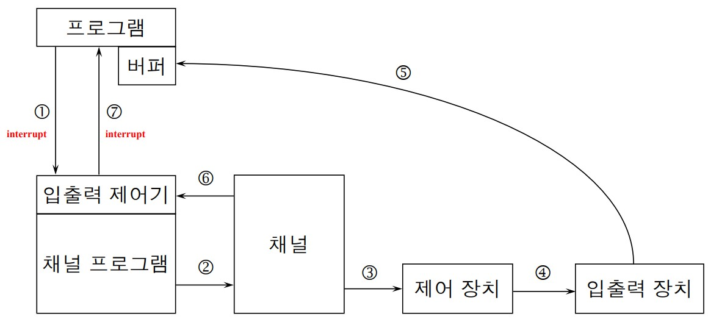

#운영체제

    다수 user를 위해 컴퓨터의 자원을 관리하는 S/W
        사용자프로그램 - 운영체제 - 보조기억장치
    메인메모리,프로세스,저장장치 관리
    => os: 프로세스 메모리 스토리지(i/o)

# 입출력 장치 제어(I/O)
* 채널프로그램
    * 채널이 수행하는 프로그램
    * 장치 접근이나 데이터 경로 제어에 필요한 연산들을 지시한다
    * OS에는 I/O채널을 가동시키는 표준 루틴이 포함되어 있다
* I/O 채널
    * I/O 전문 처리 장치(작은 CPU)
## 파일 개방 (OPEN)

    필요한 채널 프로그램을 실행
    화일에 접근할 사용자의 권한 검사
    화일의 i/o 버퍼를 할당
    디스크에 있는 첫번째 블럭을 읽어서 할당된 input버퍼에 가져온다.(cpu가 하는 게 아닌 디스크 컨트롤러가 하기 때문에 중앙 블럭이 필요해서 쓸모없는 상황이 나와도 큰 상관이 없다.)

## 파일 폐쇄(close)

    메모리에 있는 내용을 디스크에 옮기다
    출력 화일을 위해 버퍼 구역의 내용(메모리)을 출력 파일(디스크)에 기록
    버퍼구역과 채널 프로그램이 차지한 구역을 반환

# 파일 입출력

간단 요약

    1. 하드 디스크에 저장되었는지 보고, 디스크에 있는 데이터를 불러온다
    2. 램에다 소프트웨어를 올리고 동작을 할 준비를 한다
    3. 필요한 만큼 CPU에서 연산을 하며 소프트웨어를 동작시킨다

* 파일 관리자
    * 파일에 관련된 작업과 입출력 장치를 취급하는 프로그램들
    * 파일 전송과 저장에 필요한 모든 프로세서
    * OS의 일부
* I/O 버퍼
    * 디스크 내의 블록 판독을 위해 메인메모리에 예비된 공간
        * 메인메모리

            x 프로그램 실행시 메인메모리의 자리를 어느정도 차지
            -> a라는 파일을 open할때 a의 i/o버퍼를 할당한다.(버퍼크기=> 블럭크기*2 =인풋블럭,아웃풋 블럭)
            -> b라는 파일을 오픈할 때 b의 i/o버퍼를 할당한다.
            => 프로그램이 사용하는 파일의 개수에 따라 i/o버퍼의 크기가 결정된다.
* I/O 채널과 디스크 제어기
    * I/O 채널 : I/O 전문 처리 장치 (I/O를 위한 작은 CPU)
    * 채널 프로그램 : 버퍼 내의 데이타 존재 유무, 데이타 양, 저장위치 지시 등을 위한 I/O 프로그램
    * 디스크 제어기 : 디스크의 실제 운영 장치

## 파일의 판독(READ)

    프로그램이 i/o요청할 때 채널프로그램에 interrupt 발생-> 
    채널프로그램은 현재 하던 일을 끝낸 후 os(프로그램)에게 interrupt 발생
</img>

### 프로그램의 화일 READ 요청시의 작업
1. 프로그램의 READ : I/O 시스템에 인터럽트 발생
2. I/O 제어 시스템 : 주기억장치(메인메모리)에 채널프로그램 구성
 (파일 open시에 이미 구성되어 있음)
3. 지정 채널은 채널 프로그램을 읽어서 실행
4. 지정된 제어 장치로 적절한 신호 전달
5. 신호 해석 : 요청 데이타를 판독할 장치의 연산을 제어
6. 채널 프로그램 : 인터럽트를 걸어, 프로그램 수행을 재개하도록 OS에게 신호
7. 제어는 원래의 프로그램으로 반환

# 버퍼

    파일에서 데이터를 읽어들이는 주기억장치 내의 일정 구역으로 CPU의 부담을 감소시킨다.

### CPU

    I/O 발생시 진행중이던 프로그램 슬립
        => CPU가 쉬지않고 계속 수행하도록 한다
            Time sharing(시분할)
    슬립한 프로그램을 깨우는 방식=> interrupt

## 버퍼관리자
* 제한된 주기억장치의 버퍼공간의 최적 분배
* 사용자의 요구에 따라 버퍼공간 할당
* 사용되지 않는 주기억 공간을 관리
* 버퍼요구량이 할당 공간을 초과시
    * 사용자 프로세스를 지연시킨후
    * 우선순위가 낮거나 사용도가 낮은 프로세스에 할당된 버퍼공간을 회수한다

## 버퍼의 데이터 구조

    버퍼의 크기 = 채널 프로그램의 시작주소 + 버퍼데이타 구역

### 버퍼를 채우는 채널프로그램의 기본 구성
1. 파일 open시 채널프로그램이 구성된다
2. 구성된 채널프로그램은 사용자프로그램의 read명령이 있을 때까지 대기한다
3. read가 발생 시 채널프로그램은 제어장치에 I/O 시작 명령을 내린다
4. 채널프로그램은 버퍼가 채워지기를 기다린다
5. 버퍼가 다 차면 사용자프로그램이 버퍼로부터 데이터를 읽도록, 채널프로그램은 인터럽트를 발생한다
6. 이후 사용자프로그램은 버퍼가 다 찰 때까지 대기한다

    디스크 (블럭으로 나뉘어져 있다)(피지컬)에서 i/o버퍼로 읽어온다
    i/o버퍼에서 (레코드로 이루어져 있다)(로지컬) 레코드를 프로그램의 작업구역에 옮긴다

### 파일 판독(read)일 경우

생산자 : 채널 프로그램, 소비자 : 사용자 프로그램

### 파일 기록(write)일 경유
생산자 : 사용자 프로그램, 소비자 : 채널 프로그램

    버퍼 입장에서 보면 데이터를 주는 쪽: 생산자 와 데이터를 받는 쪽: 소비자 가 있다.
    즉 읽기 쓰기일 때 생산자, 소비자가 다르다.

## 예상버퍼링(BF=1(블럭 당 레코드의 수))
디스크에서 한블럭 미리 갖다 놓는것=> 예상 버퍼링

### 목적
* 프로그램이 데이터를 요청하는 인터럽트를 발생하고, 대기상태에 있을 가능성을 최소화 한다
* I/O 제어시스템이 프로그램이 필요로 할 데이터를 미리 예측해서 항상 버퍼를 가득 채워넣는다
    * 이를 통해 프로그램은 버퍼가 채워질 때까지 기다릴 필요가 없다

### 예상버퍼의 구조
채널 프로그램의 시작주소+ `플래그(full_flag)` +버퍼데이터 구역
* 플래그(full_flag): 버퍼가 비어 있으면 0, 채워 있으면 1

### 예상버퍼의 채널프로그램
* 생산자 루틴
    1. 버퍼가 공백 (full_flag=0)이 될 때까지 대기한다
    2. 디스크 제어기에 i/O 시작 명령을 내린다
    3. 버퍼가 채워지는 동안 대기한다
    4. full_flag=1이 된다
* 소비자 루틴
    1. 버퍼가 공백이면 대기한다
    2. 버퍼가 채워질 때(full_flag=1) 버퍼에 있는 레코드를 작업구역으로 이동한다
    3. full_flag=0이 된다

## 예상버퍼(BF=n(블럭 당 레코드의 수))

### 예상버퍼의 구조
채널 프로그램의 시작주소+플래그+ `레코드 카운터(rec_ctr)` +버퍼데이터 구역

### 예상버퍼의 채널프로그램
* 생성자 루틴
    1. 버퍼가 공백일 때까지 대기한다
    2. 버퍼가 차면(full_flag=1) 디스크 제어기에 I/O시작 명령을 내린다
    3. 버퍼가 채워질 때까지 대기한다
    4. 버퍼가 차면 rec_ctr(레코드카운터)=1, full_flag=1 이 된다
* 소비자 루틴
    1. 버퍼가 공백이면 대기한다
    2. 레코드 카운터가 지시하는 레코드를 작업 구역으로 이동시킨다
    3. rec_ctr+=1 해준다
    4. n개의 레코드를 전부 처리해서(rec_ctr>n) 버퍼가 공백이 되면 full_flag=0이 된다

## 이중 버퍼
### 버퍼 구조
예상버퍼의 구조 + `다음 버퍼 주소(circular linked state)`
### 이중버퍼의 채널프로그램
* 생산자 루틴
    1. to_fill.buffer가 공백이 될 때까지 대기한다
    2. 디스크 제어기에 I/O 시작 명령을 내린다
    3. to_fill.buffer가 채워질 때까지 대기한다
    4. 버퍼가 채워지면 rec_ctr=1, full_flag=1, `to_fill= to_fill.next_buffer`
        * to_fill에서 to_fill다음에 채워져야 할 버퍼를 지시한다
* 소비자 루틴
    1. to_empty.buffer가 채워질 때 까지 대기한다
    2. to_empty.record_counter가 지시하는 레코드를 작업 구역으로 이동한다
    3. n개의 레코드를 모두 처리해서 공백이 된 경우(rec_ctr>n)
        * full_flag=0
        * to_empty = to_empty.next
            * to_empty는 다음에 비워야 할 버퍼를 지시한다.

i/o버퍼(이중, 삼중..)를 늘리면 다중버퍼 disk access(디스크에서 옮겨야 하는 횟수)가 줄어들어 i/o가 빠르지만 메인메모리를 사용하는 다른 부분에서 부담이 커진다.
